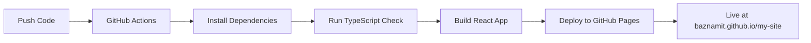

# 🚀 GitHub Pages Deployment Guide

Your modern React portfolio is **fully configured** for GitHub Pages deployment! Here are multiple ways to deploy it.

## ✅ **Automatic Deployment (Recommended)**

I've set up **GitHub Actions** to automatically deploy your site whenever you push to the main branch.

### **Setup Steps:**

1. **Push your code to GitHub:**
   ```bash
   git add .
   git commit -m "Add modern portfolio website"
   git push origin portfolio-v2
   ```

2. **Enable GitHub Pages in your repository:**
   - Go to your repository on GitHub: `https://github.com/baznamit/my-site`
   - Click **Settings** tab
   - Scroll down to **Pages** section
   - Under **Source**, select **GitHub Actions**

3. **That's it!** 🎉
   - GitHub Actions will automatically build and deploy your site
   - Your site will be available at: `https://baznamit.github.io/my-site/`

## 🔄 **Manual Deployment Options**

### **Option 1: Using npm script**
```bash
# Install dependencies first
npm install

# Build and deploy
npm run deploy
```

### **Option 2: Manual build and deploy**
```bash
# Build the project
npm run build

# Deploy the dist folder to gh-pages branch
npx gh-pages -d dist
```

## 🛠️ **Configuration Explained**

### **Vite Configuration (`vite.config.ts`)**
```typescript
export default defineConfig({
  base: '/my-site/',  // ✅ Correct for GitHub Pages
  build: {
    outDir: 'dist',   // ✅ Output directory
    sourcemap: true   // ✅ For debugging
  }
})
```

### **GitHub Actions Workflow (`.github/workflows/deploy.yml`)**
- ✅ Automatically triggers on push to main/portfolio-v2
- ✅ Builds the React app
- ✅ Deploys to GitHub Pages
- ✅ Uses latest Node.js and dependencies

## 🌐 **Your Deployment URLs**

After deployment, your portfolio will be available at:
- **Main URL:** `https://baznamit.github.io/my-site/`
- **Custom domain:** You can add a custom domain in GitHub Pages settings

## 📋 **Pre-Deployment Checklist**

- [x] **Vite config** - ✅ Configured for GitHub Pages
- [x] **Package.json** - ✅ Deploy script added
- [x] **GitHub Actions** - ✅ Workflow file created
- [x] **Assets paths** - ✅ All paths are relative
- [x] **Build optimization** - ✅ TypeScript compilation included

## 🔧 **Troubleshooting**

### **Common Issues & Solutions:**

1. **404 Error on refresh:**
   - ✅ **Already fixed!** The app uses hash-based routing

2. **Assets not loading:**
   - ✅ **Already configured!** All asset paths are relative

3. **Build fails:**
   ```bash
   # Check for TypeScript errors
   npm run lint
   
   # Test build locally
   npm run build
   npm run preview
   ```

4. **GitHub Actions failing:**
   - Check the Actions tab in your GitHub repository
   - Ensure you have enabled GitHub Pages with "GitHub Actions" as source

## 📈 **Deployment Process**



## 🎯 **Next Steps After Deployment**

1. **Test your live site:**
   - Check all sections work correctly
   - Test responsive design on mobile
   - Verify all links and animations

2. **Update content:**
   - Add your real projects
   - Update contact information
   - Replace placeholder images

3. **SEO & Performance:**
   - Add Google Analytics (optional)
   - Submit to search engines
   - Test performance with Lighthouse

## 📱 **Mobile Testing**

Your deployed site will be fully responsive. Test on:
- Mobile phones (iOS/Android)
- Tablets
- Different screen sizes
- Various browsers

## 🔗 **Custom Domain (Optional)**

To use a custom domain like `namitsingh.dev`:

1. **Add CNAME file** to your repository root:
   ```
   namitsingh.dev
   ```

2. **Configure DNS** at your domain provider:
   ```
   CNAME record: www -> baznamit.github.io
   A records: @ -> GitHub Pages IPs
   ```

3. **Enable in GitHub Pages settings**

---

## 🎉 **You're All Set!**

Your modern portfolio is ready for GitHub Pages deployment. Simply push your code and watch it automatically deploy! 

**Live URL:** `https://baznamit.github.io/my-site/` (available after first deployment)

**Need help?** Check the GitHub Actions tab in your repository for deployment status and logs.